# Rodi ERD

초보 운전자를 위한 연습 장소·코스 탐색 서비스의 데이터 모델.

**핵심 설계**
- 위치는 **PostGIS `geometry(Point, 4326)`** 로 저장, 반경 검색 등 공간쿼리가 핵심.
- **`place`는 `parking`(주차장)·`course`(코스)의 슈퍼클래스** (JOINED 상속, `place_id` 공유 PK) → [ADR 0002](adr/0002-place-joined-inheritance.md).
- **지역**은 계층 `region` 테이블(중심좌표+반경) + PostGIS 보완 → [ADR 0003](adr/0003-region-hierarchy-and-postgis.md).
- **회원 탈퇴는 soft delete**(`member.deleted_at`) + PII 익명화 → [ADR 0004](adr/0004-member-soft-delete.md).
- **소셜 로그인은 `social_account`(신원)·`refresh_token`(세션) 분리** → [ADR 0008](adr/0008-social-login.md)·[ADR 0009](adr/0009-authentication-authorization.md).

## ER 다이어그램

```mermaid
erDiagram
    region ||--o{ region : "상위-하위"
    region ||--o{ place : ""
    place ||--o| parking : "상속"
    place ||--o| course : "상속"
    member ||--o| member_onboarding : "1:1"
    member ||--o{ social_account : ""
    member ||--o{ refresh_token : ""
    course ||--o{ course_practice_type : ""
    practice_type ||--o{ course_practice_type : ""
    course ||--o{ waypoint : ""
    member ||--o{ favorite : ""
    place ||--o{ favorite : ""
    member ||--o{ driving_record : ""
    course ||--o{ driving_record : ""

    member {
        bigint id PK
        varchar email "이메일"
        varchar nickname "닉네임(가입 시 후보 풀에서 무작위 부여, unique)"
        varchar level "레벨(SEED/ROOKIE/OWNER/EXPLORER/NAVIGATOR), 온보딩 전 null"
        varchar driving_goal "운전 목표(최대 30자, 마이페이지 노출). null 가능"
        timestamptz created_at
        timestamptz updated_at
        timestamptz deleted_at "탈퇴 일시(soft delete, null=활성)"
        timestamptz anonymized_at "익명화 일시(유예 경과 후)"
    }

    social_account {
        bigint id PK
        bigint member_id FK "회원"
        varchar provider "공급자(KAKAO/APPLE)"
        varchar provider_id "공급자 사용자 ID"
        varchar email "공급자 이메일"
        varchar provider_refresh_token "공급자 refresh token(애플 revoke용). null 가능"
        varchar provider_nickname "공급자 프로필 닉네임(서비스 닉네임과 별개)"
        varchar provider_profile_image_url "공급자 프로필 이미지 URL"
        timestamptz created_at
        timestamptz updated_at
    }

    refresh_token {
        bigint id PK
        bigint member_id FK "회원"
        varchar token_hash "토큰 해시(원문 미저장)"
        timestamptz expires_at "만료 시각"
        timestamptz revoked_at "폐기 시각(재사용 탐지, null=유효)"
        bigint replaced_by_token_id "회전 계보(감사)"
        timestamptz last_used_at "마지막 사용(감사)"
        timestamptz created_at
        timestamptz updated_at
    }

    region {
        bigint id PK
        bigint parent_id FK "상위 지역"
        varchar name "지역명"
        smallint depth "계층 깊이(1:시도,2:시군구,3:지구)"
        geometry center "중심 좌표(Point,4326)"
        int radius_meters "반경(m)"
    }

    practice_type {
        bigint id PK
        varchar name "연습 유형명(코스용 참조. 회원 선호는 member_onboarding에 enum jsonb로 저장)"
    }

    member_onboarding {
        bigint member_id PK,FK "member와 1:1(공유 PK)"
        varchar driving_period "Q1 실제 운전기간"
        varchar recent_frequency "Q2 최근 운전빈도"
        varchar solo_driving_range "Q4 혼자 운전범위"
        varchar solo_parking_level "Q5 혼자 주차수준"
        jsonb road_experiences "Q3 도로주행 경험(복수)"
        jsonb practice_types "선호 연습유형(순서=우선순위, 최대 3)"
        varchar car_type "차종(단일). null 가능"
        timestamptz onboarded_at "온보딩 완료 시각(재제출 거부 판정)"
    }

    place {
        bigint id PK
        varchar place_type "PARKING | COURSE"
        bigint region_id FK "지역"
        varchar name "장소명"
        geometry location "좌표(Point,4326)"
        smallint difficulty "난이도(1 매우쉬움~5 매우어려움)"
        decimal recommendation "추천도(0.0~5.0)"
        int favorite_count "찜 개수"
        varchar lot_address "지번 주소"
        varchar road_address "도로명 주소"
        text intro "코멘트"
        timestamptz created_at
        timestamptz updated_at
    }

    parking {
        bigint place_id PK "place 상속(공유 PK)"
        int parking_spaces "주차면수"
        varchar operating_hours "영업 시간"
        varchar fee_info "요금 안내"
    }

    course {
        bigint place_id PK "place 상속(공유 PK)"
        int distance_meters "주행거리(m)"
    }

    course_practice_type {
        bigint course_id PK,FK
        bigint practice_type_id PK,FK
    }

    waypoint {
        bigint id PK
        bigint course_id FK "코스"
        varchar waypoint_type "START|VIA|DESTINATION"
        smallint sequence "경로 순서"
        geometry location "좌표(Point,4326)"
        varchar name "지점명"
    }

    favorite {
        bigint id PK
        bigint member_id FK
        bigint place_id FK
        timestamptz created_at
    }

    driving_record {
        bigint id PK
        bigint member_id FK "회원"
        bigint course_id FK "이용한 코스"
        int distance_meters "주행거리(m)"
        timestamptz driven_at "이용 일시"
    }
```

## Enum

| Enum | 값 |
|------|-----|
| `member.level` | SEED / ROOKIE / OWNER / EXPLORER / NAVIGATOR |
| `member_onboarding.car_type` | LIGHT(경차) / COMPACT(소형차) / MIDSIZE(중형차) / SEMI_LARGE(준대형) / LARGE(대형차) / SUV |
| `member_onboarding.driving_period` (Q1) | UNDER_1_MONTH / MONTHS_1_3 / MONTHS_3_6 / MONTHS_6_12 / YEARS_1_2 / YEARS_2_10 / OVER_10_YEARS |
| `member_onboarding.recent_frequency` (Q2) | RARELY / MONTHLY_1_2 / WEEKLY_1 / WEEKLY_2_3 / WEEKLY_4_PLUS |
| `member_onboarding.road_experiences` (Q3, jsonb 복수) | NONE / ACCOMPANIED / PROFESSIONAL_TRAINING / SOLO |
| `member_onboarding.solo_driving_range` (Q4) | NEAR_HOME / FAMILIAR_ROAD / UNFAMILIAR_ROAD / HIGHWAY_LONG |
| `member_onboarding.solo_parking_level` (Q5) | NONE / WIDE_ONLY / FAMILIAR_PLACE / MOSTLY_POSSIBLE |
| `member_onboarding.practice_types` (jsonb, 순위) | U_TURN / LEFT_RIGHT_TURN / PARKING / LANE_CHANGE / INTERSECTION / ROUNDABOUT / UNPROTECTED_LEFT_TURN / HIGHWAY_ENTRY / CORNERING / NARROW_ROAD / MULTILANE / MERGING / STRAIGHT |
| `place.place_type` | PARKING / COURSE |
| `waypoint.waypoint_type` | START(출발지) / VIA(경유지) / DESTINATION(목적지) |

> `member.level`: **클라이언트가** 운전 경험 점수(0~14)를 5단계로 변환해 전송(Q1 `2~10년`/`10년 이상`→NAVIGATOR 강제 포함). 서버는 enum 검증 후 `member.level`에 저장(점수는 미저장). 상세: [스펙 004-onboarding](specs/004-onboarding.md).

## 엔티티 요약

| 테이블 | 설명 |
|--------|------|
| `member` | 회원. 신원은 `social_account`가 관리(별도). 노출·활용값만 보유(`level`·`driving_goal`)+닉네임·이메일. soft delete. |
| `social_account` | 소셜 신원(회원 1:N). 안정 식별자 `(provider, provider_id)` 유니크. 공급자 프로필(닉네임·이미지)·애플 refresh token 보관. |
| `refresh_token` | 세션(회원 1:N). 해시 저장·회전·재사용 탐지. `token_hash` 유니크. |
| `member_onboarding` | 온보딩 원자료(운전경험·추가정보). member와 1:1(member_id 공유 PK). 복수/순위 응답은 jsonb 리스트. 저장 목적(마이페이지 미노출). |
| `practice_type` | 연습 유형 코드(유턴·직선주행·… 13종). **코스용 참조 테이블**. 회원 선호는 `member_onboarding.practice_types`에 enum jsonb로 저장. |
| `region` | 지역(계층). 중심좌표+반경으로 지도 그룹 표시. |
| `place` | 주차장·코스 공통 슈퍼클래스. 좌표·난이도·추천도·찜개수·주소·코멘트. |
| `parking` | 주차장(place 상속). 주차면수·영업시간·요금. |
| `course` | 코스(place 상속). 주행거리. |
| `course_practice_type` | 코스 ↔ 연습 유형 (N:M). |
| `waypoint` | 코스 경유지(1:N). 출발/경유/목적지 + 순서 + 좌표. |
| `favorite` | 찜. 회원 ↔ place(주차장·코스 공통). `(member_id, place_id)` 유니크. |
| `driving_record` | 운전 기록(이용 경로 히스토리). 마이페이지 시각화 + 추후 리뷰 신뢰도 근거. |

## 주요 제약·인덱스

- `member` unique `(nickname)`
- `social_account` unique `(provider, provider_id)` · FK `member_id`
- `refresh_token` unique `(token_hash)` · index `member_id`
- `member_onboarding` PK `member_id`(= member 1:1 공유 PK, FK)
- `place.location` **GiST 공간 인덱스** (반경 검색)
- `place.region_id` 인덱스
- `waypoint` unique `(course_id, sequence)`
- `favorite` unique `(member_id, place_id)`
- `driving_record.member_id` 인덱스

## 추후 (미확정)

- **리뷰** — 장소·코스 후기·평점. `driving_record`로 이용 여부를 검증해 신뢰도 표시 가능.
- **신고 / 차단** — 리뷰 기능 착수 시 `review_report`, `member_block`(회원↔회원) 등을 함께 설계. 기존 테이블 변경 없이 얹는 구조.
