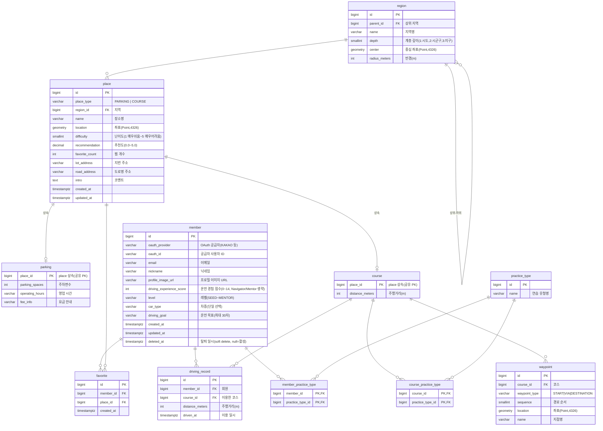

# Rodi ERD

초보 운전자를 위한 연습 장소·코스 탐색 서비스의 데이터 모델.

**핵심 설계**
- 위치는 **PostGIS `geometry(Point, 4326)`** 로 저장, 반경 검색 등 공간쿼리가 핵심.
- **`place`는 `parking`(주차장)·`course`(코스)의 슈퍼클래스** (JOINED 상속, `place_id` 공유 PK) → [ADR 0002](adr/0002-place-joined-inheritance.md).
- **지역**은 계층 `region` 테이블(중심좌표+반경) + PostGIS 보완 → [ADR 0003](adr/0003-region-hierarchy-and-postgis.md).
- **회원 탈퇴는 soft delete**(`member.deleted_at`) + PII 익명화 → [ADR 0004](adr/0004-member-soft-delete.md).

## ER 다이어그램

## Enum

| Enum | 값 |
|------|-----|
| `member.level` | SEED / ROOKIE / DRIVER / OWNER / EXPLORER / NAVIGATOR / MENTOR |
| `member.car_type` | COMPACT(소형) / MIDSIZE(중형) / SUV / LARGE(대형) / VAN(승합) / LIGHT(경차) |
| `place.place_type` | PARKING / COURSE |
| `waypoint.waypoint_type` | START(출발지) / VIA(경유지) / DESTINATION(목적지) |

> `member.level`: 온보딩 점수(0~14)로 SEED~EXPLORER 배정. 단, Q1 "3년 이상"→NAVIGATOR, "10년 이상"→MENTOR **강제 배정(점수 무관)**이라 레벨을 점수에서 항상 파생할 수 없어 컬럼으로 저장.

## 엔티티 요약

| 테이블 | 설명 |
|--------|------|
| `member` | 회원. OAuth2(카카오), `(oauth_provider, oauth_id)` 유니크. 온보딩 속성(점수·레벨·차종·선호유형·목표). soft delete. |
| `member_practice_type` | 회원 ↔ 선호 연습 유형 (N:M). |
| `practice_type` | 연습 유형 코드(유턴·직선주행·… 13종). 회원 선호·코스 유형 공용. |
| `region` | 지역(계층). 중심좌표+반경으로 지도 그룹 표시. |
| `place` | 주차장·코스 공통 슈퍼클래스. 좌표·난이도·추천도·찜개수·주소·코멘트. |
| `parking` | 주차장(place 상속). 주차면수·영업시간·요금. |
| `course` | 코스(place 상속). 주행거리. |
| `course_practice_type` | 코스 ↔ 연습 유형 (N:M). |
| `waypoint` | 코스 경유지(1:N). 출발/경유/목적지 + 순서 + 좌표. |
| `favorite` | 찜. 회원 ↔ place(주차장·코스 공통). `(member_id, place_id)` 유니크. |
| `driving_record` | 운전 기록(이용 경로 히스토리). 마이페이지 시각화 + 추후 리뷰 신뢰도 근거. |

## 주요 제약·인덱스

- `member` unique `(oauth_provider, oauth_id)`
- `place.location` **GiST 공간 인덱스** (반경 검색)
- `place.region_id` 인덱스
- `waypoint` unique `(course_id, sequence)`
- `favorite` unique `(member_id, place_id)`
- `driving_record.member_id` 인덱스

## 추후 (미확정)

- **리뷰** — 장소·코스 후기·평점. `driving_record`로 이용 여부를 검증해 신뢰도 표시 가능.
- **신고 / 차단** — 리뷰 기능 착수 시 `review_report`, `member_block`(회원↔회원) 등을 함께 설계. 기존 테이블 변경 없이 얹는 구조.
